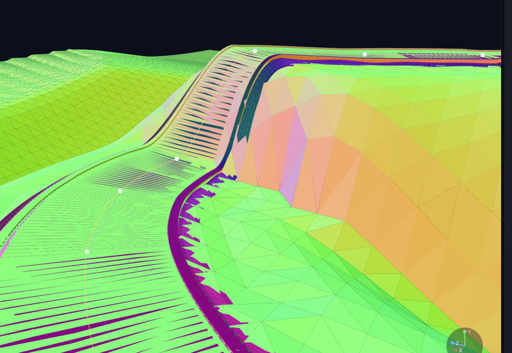
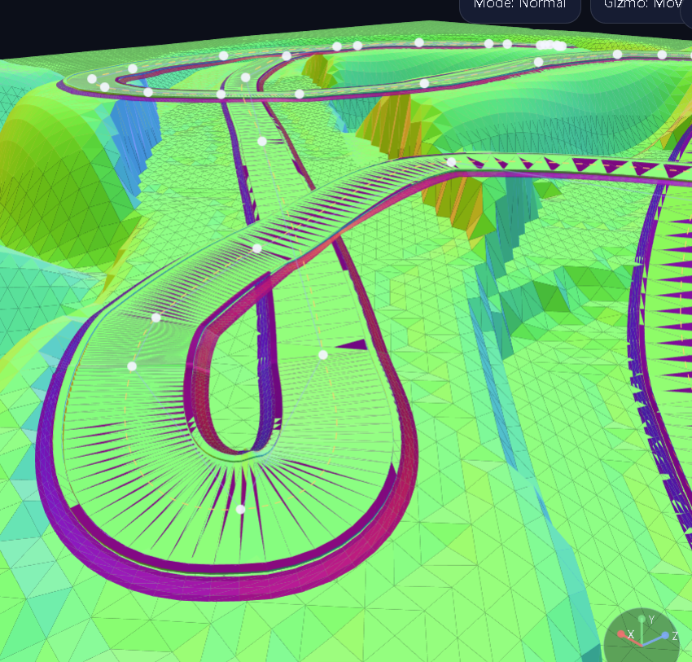
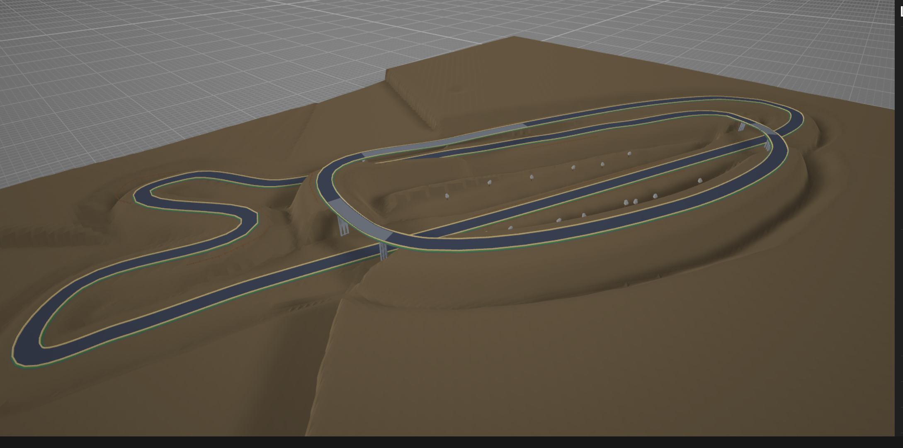
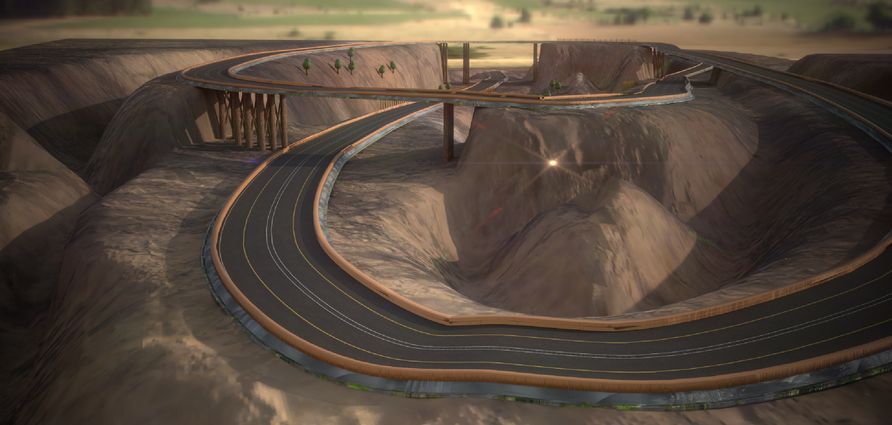

# KARTMAKER ARGH


Single-file browser app for building Mario Kart / F1-style tracks with 2D spline editing, 3D preview, procedural generation, and OBJ export with basic materials setup.

## Gallery






## Why This Repo

- Fast in-browser workflow: draw in 2D, inspect in 3D, export immediately
- Advanced road tooling: Join, Y Split, Roundabout, lane/direction metadata
- Procedural generation with interchange templates and terrain/theming
- No build step, no external runtime dependency required

## Quick Start

1. Open `index.html` in Chrome, Edge, or Firefox.
2. Click **Generate Track** or draw manually.
3. Refine geometry and branching.
4. Click **Export OBJ** or **Export FBX (Enfusion)**.

Optional local server:

```bash
python -m http.server 8080
```

Then open `http://localhost:8080`.

## Key Features

- 2D cubic Bezier road editing
- 3D offline software preview
- Road class, lane, and direction controls
- Lane-level network descriptor output
- Junction metadata and routing hooks
- Terrain, support styles, and prop placement/editing
- OBJ + MTL export
- FBX (ASCII) export with Enfusion collision helper objects (`VIS_Main_LOD0`, `GEO_Collision`, `ROADWAY_Collision`)
- Enfusion terrain package export (`.r16` heightmap + road/island masks + metadata JSON)

## Arma Reforger / Enfusion Terrain Workflow

The tool can now export a terrain package tuned for Enfusion world setup and navmesh rebuild workflows:

- **`<track>_terrain_h16le.r16`**: 16-bit little-endian RAW heightmap (for terrain import).
- **`<track>_road_mask.pgm`**: grayscale mask for road corridor painting/material assignment.
- **`<track>_island_mask.pgm`**: grayscale island edge falloff mask for coast/cliff blending.
- **`<track>_terrain_enfusion.json`**: origin, spacing, height range, and import notes.

Recommended in Enfusion (based on official terrain workflow docs):

1. Import RAW heightmap with matching sample dimensions.
2. Set terrain world scale from `cellSizeX`, `cellSizeZ`, and origin values in JSON.
3. Use road mask to paint driveable surface and navmesh-friendly road margins.
4. Rebuild navmesh after terrain and road surface layers are finalized.

The **Terrain** panel also includes island shaping controls:

- Island offset from track footprint
- Island falloff width (coastline/cliff band)
- Island drop depth below track base level

This produces an island-like topo silhouette while preserving road clearance and bridge safety.

## Enfusion FBX Export

Use **Export FBX (Enfusion)** to generate:

- `*_enfusion.fbx` (ASCII FBX 7.4)
- `*_enfusion_fbx_notes.txt`

Included FBX object names are prepared for Enfusion Blender Tools handoff:

- `VIS_Main_LOD0` (visual mesh)
- `GEO_Collision` (geometry collision helper)
- `ROADWAY_Collision` (roadway collision helper)

Recommended flow:

1. Import FBX in Blender.
2. Use Enfusion Blender Tools to assign these objects to your exact LOD/collision setup.
3. Export/package through your standard Enfusion asset pipeline.

## Repo Layout

- `index.html` - full application
- `README.md` - documentation
- `Screenshots/` - repo gallery images

## Git

Initial push:

```bash
git init
git add index.html README.md Screenshots
git commit -m "Initial KARTMAKER ARGH commit"
git branch -M main
git remote add origin https://github.com/<user>/<repo>.git
git push -u origin main
```

Update flow:

```bash
git add .
git commit -m "Describe your change"
git push
```
